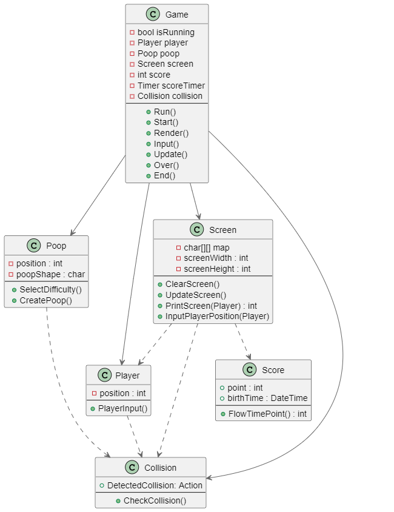
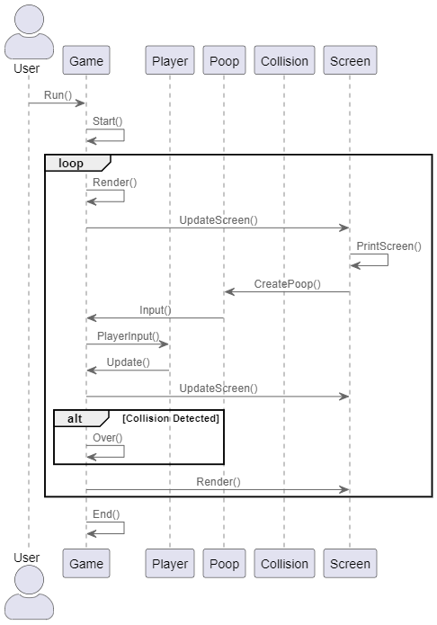
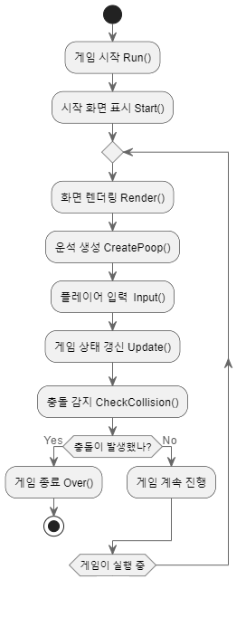

# 운석 피하기

하늘에서 떨어지는 운석을 플레이어가 피해서 점수를 얻는 게임입니다.   
C#을 사용해 콘솔창에 구현했습니다.

## 제작 기간

- 2024.8.12 ~ 2024.8.16
- 경일게임아카데미 두번째 레벨테스트 실습

## 제작자
- 박준민
- XR기술을 활용한 게임 개발자 과정 - 1기 과정

## 게임 장르 및 조작 방법
- 2D 횡스크롤로 움직여 하늘에서 내려오는 운석을 피하는 게임입니다.
- 플레이어는 키보드 좌, 우 화살표키를 입력해 캐릭터를 움직여 하늘에서 떨어지는 운석을 피할 수 있습니다.
- 게임을 시작한 이후 1초에 100점씩 점수를 얻습니다.

## 개발 환경
IDE : Visual Studio 2022

## 구현 방법
- Screen 클래스에서 Define 클래스에 정의된 화면크기 상수를 사용해 화면 크기를 결정한 후 문자배열을 선언한다.   
- ClearScreen 메서드로 화면을 빈칸 ' '으로 초기화 한다.
- UpdateScreen 메서드는 기존의 화면에 표시된 오브젝트들을 한칸씩 아래로 내려주는 작업을 한다. 
- 2차원 문자 배열에서 인덱스상 y좌표가 더 큰 위치에 한칸 낮은 위치의 오브젝트들을 넣는다.
- 스크린의 가장 위(인덱스 0)는 CreatePoop 메서드로 운석을 생성해주어야 하므로 빈칸으로 초기화시킨다.
- PrintScreen 메서드로 문자 배열의 요소들을 순회하며 화면에 출력한다.
- 일정 범위의 난수를 생성해 특정 숫자보다 난이도로 설정한 수 보다 낮을 경우 운석을 생성한다.
- 충돌 체크용 Collision 클래스에서 CheckCollision 메서드에서 이벤트를 사용해 충돌이 일어났을 경우 게임루프 OVER를 실행해 게임을 종료한다.
- 게임시작시 시작한 시간을 저장 후 게임 시작후 1초가 지날때마다 100점씩 점수를 추가한다
- Console.KeyAvailable 의 키 입력이 가능하면 true, 불가능하다면 false를 반환하는 조건을 이용해 Console.ReadKey(true)를 사용, 사용자의 키 입력을 받아 이동을 구현했다.
  - Console.Readkey(ture) : 입력 된 키를 콘솔에 표시하지 않음
  - Console.Readkey(false) : 입력 된 키를 콘솔에 표시

## 프로그램 구조 도식화

### 클래스 다이어그램

### 시퀀스 다이어그램

### 플로우 차트

  
